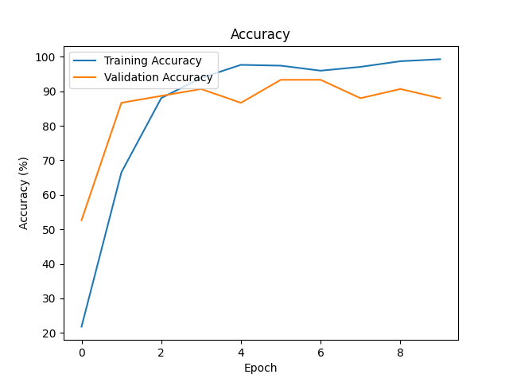

# Lab HomeWork
## 環境版本
- Python 3.8.10
- ubunbu 20.04
- R5-5600x
- RTX3070Ti-8G

## START

### 建立虛擬環境
```zsh
python -m venv tutorial-env
```
### 進入 venv 虛擬環境
```zsh
source myenv/bin/activate
```
### 離開虛擬環境
```zsh
deactivate
```

## 安裝 python 套件
```zsh
pip3 install torch numpy matplotlib pillow torchvision torchsummary torchaudio
```


## 第一次訓練
- batch_size = 32 (Batch Size)
- lr = 1e-4 (Learning Rate)
- epochs = 10 (epoch 次數)
- optim.Adam

發現測試集很多都判斷錯誤



## 第二次訓練
- batch_size = 16 (Batch Size)
- lr = 1e-5 (Learning Rate)
- epochs = 20 (epoch 次數)
- optim.Adam

發現測試集還是有錯誤


## 第三次訓練
- batch_size = 16 (Batch Size)
- lr = 1e-5 (Learning Rate)
- epochs = 30 (epoch 次數)
- optim.Adam

錯誤有減少了

