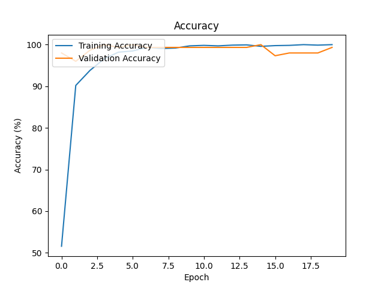

# 關於第一題 Deep Learning 相關的說明 
## 程式碼思路說明
1. 進行前置作業，將需要相關的套件 import 並且確定是使用 CPU or Cuda
2. 建立一個 dataset class，當中一些會用到的參數
3. 建立資料處理方法
4. 設定 HyperParameters，包含 Batch size、Epochs、Learning Rate 等
5. 設定訓練集及資料集相關設定
6. 設定 VGG16 模型，並更改最後一層輸出為 15 種類別，選擇使用哪種 loss function
7. 訓練階段，並將 model 設為 GPU 跑，並在 training 的時候更新梯度權重
8. 在驗證階段時，並沒有更新梯度權重，只有計算 accuracy
9. 將 train loss 及 accuracy 輸出成圖表
10. 對測試集進行測試，並匯出 xlsx 檔

## 第一次訓練
- batch_size = 32 (Batch Size)
- lr = 1e-4 (Learning Rate)
- epochs = 10 (epoch 次數)
- optim.Adam

發現測試集很多都判斷錯誤

## 第二次訓練
- batch_size = 16 (Batch Size)
- lr = 1e-5 (Learning Rate)
- epochs = 20 (epoch 次數)
- optim.Adam

發現測試集還是有錯誤

## 第三次訓練
- batch_size = 16 (Batch Size)
- lr = 1e-5 (Learning Rate)
- epochs = 30 (epoch 次數)
- optim.Adam

錯誤有減少了

